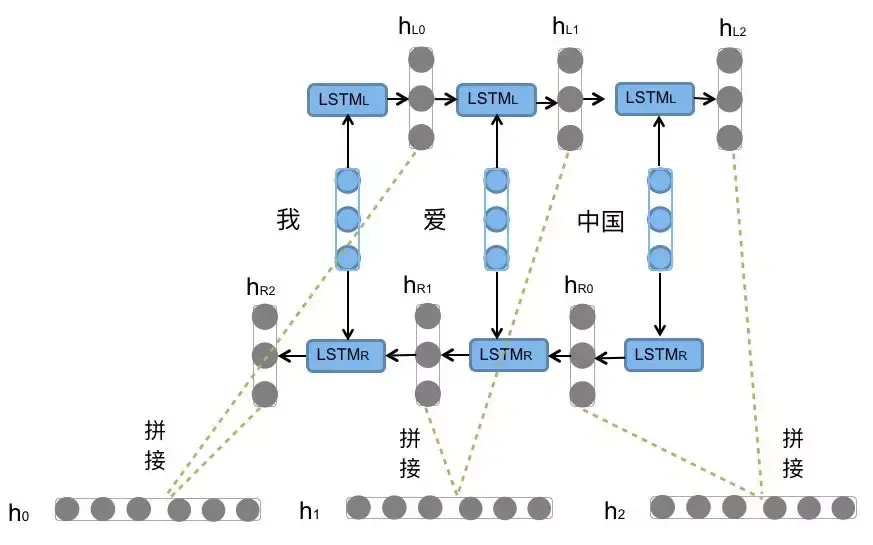
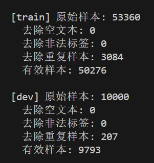
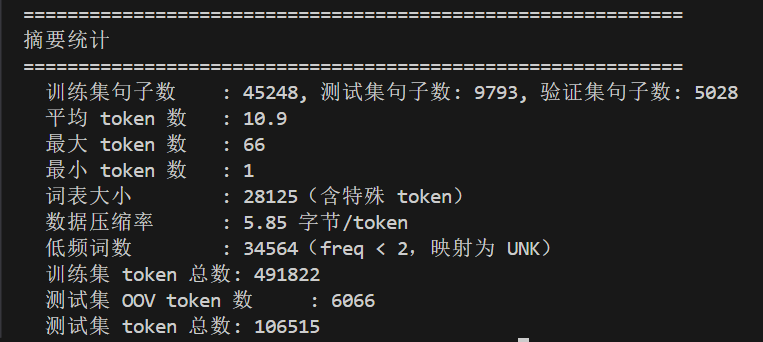
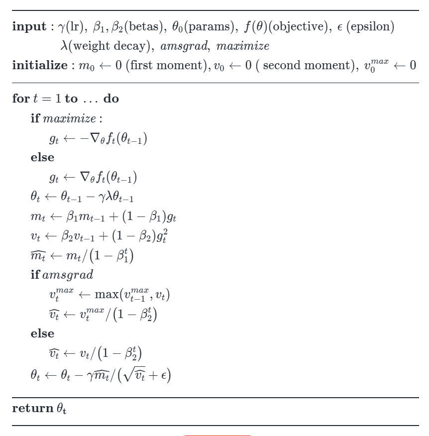
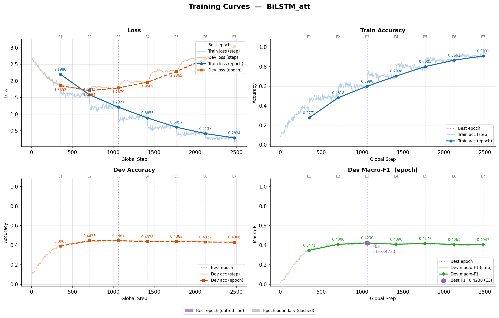
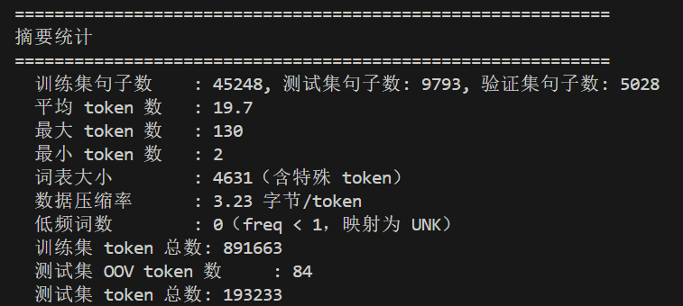
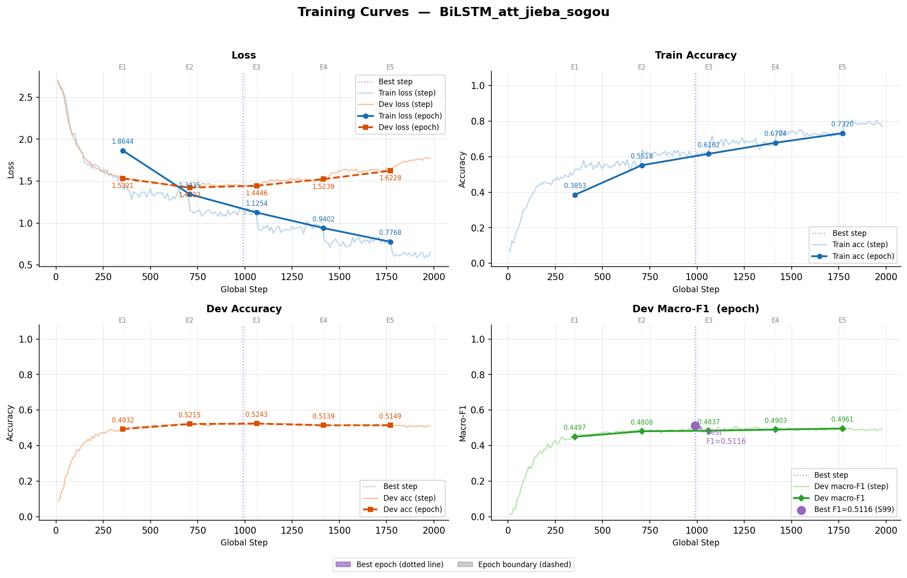
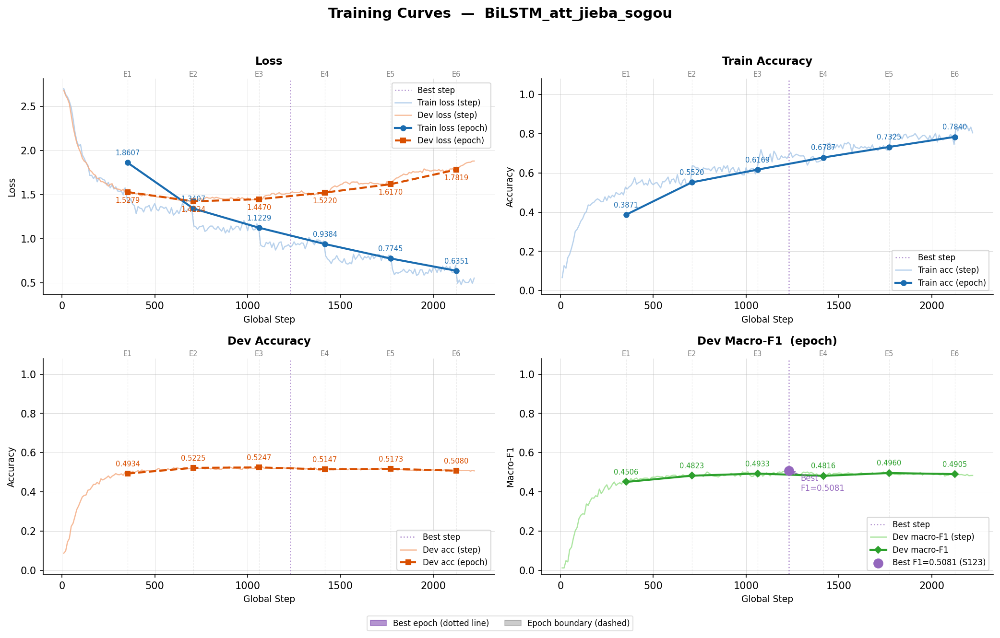

bilstm+attention：

双向lstm，会利用两边的隐向量，最终句子表示可以通过self-attention



$$
out=(B,L,2*H_{out})\\
W=(2*H_{out},1)\\
\alpha=\text{softmax}(tanh{(out)}W)=(B,L,1)\\
\sum_l\alpha*out=(B,2*H_{out})
$$


### 数据预处理

原数据为jsonl格式（即每行一个json对象，可以独立解析）

```json
{ label, 	// 为标签数字
label_desc,  	// 标签含义
sentence,    	// 句子
keywords}	// 关键词
```


空样本或纯空白样本，非法标签，重复样本（句子和标签完全一致），类别图片见 `image\data_analysis\train_label_distribution.png`



没有空文本和非法标签，有多个重复样本

news_stock 类比的数据较少


`unicodedata.category` 通过这个可以判断unicode的一些不可见字符

全角转半角 `str` 提供 `translate` 对表格进行转换，没出现的字符保留

通过正则表达式 `\s+` 表示连续空白字符，可以通过 `re.sub` 进行合并空白

对于数字和英文，他们是有特定含义的，因此不能去除，文本分类中标点符号不太重要，可以去除，数字由于直接保留会导致词汇表太大，因此可以使用 `<NUM> 表示`

中文区间：\u4e00-\u9fff (基本汉字) + \u3400-\u4dbf (扩展A)

清洗的文本存在 `cleaned` 字段


jieba分词：使用精确模式，不存在冗余单词（搜索引擎模式，会将长词再次切分，有冗余，可以增加搜索准确率），对于文本分类任务精确模式就足够了

缺点：OOV现象



数据多为短文本，因此平均token数在10.9左右，出现了较多OOV现象

分词样例

```
  样例(train[0]):
    原文  : 新骗局！一分不投两年赚2400万 至少已有数百人入群
    清洗后: 新骗局一分不投两年赚<NUM>万 至少已有数百人入群
    分词  : ['新', '骗局', '一分', '不', '投', '两年', '赚', '<NUM>', '万', '至少', '已有', '数百人', '入群']
```


lr_scheduler：step方式每轮epoch对lr进行下降

精确率：所有预测为正的有多少是正的；召回率：所有真实正样本有多少被找出来

$$
Precision = \frac{TP}{TP + FP}\\
Recall = \frac{TP}{TP + FN}
$$

$$
F1_i = \frac{2 \cdot Precision_i \cdot Recall_i}{Precision_i + Recall_i}
$$

多分类F1，对每个类别做二分类f1计算，然后取平均


对于CE loss：为15分类，随机为 $-\log(1/15) =2.7$


adamW增加了weight_decay：用于减小权重，越大时模型参数会越小（类似L2正则化）



lr调度器：step（每隔几个epoch，将lr乘上系数gamma）；cosine（随着epoch缓慢降低学习率）


测试没有使用预训练词向量下，jieba分词的结果，在attention下



出现了一个非常奇怪的现象，就是验证集的准确率平稳慢慢上升，但是loss竟然也在大幅度上升

原因：根据CE公式，当模型对错误样本过于自信会导致loss极端上升，一般由于过拟合导致，可以看到train 的acc非常高

### bilstm+jieba+无预训练向量

有 attention 的时候：9,290,763，在P4 GPU 上面大约23.9s （触发了早停）
没有 attention 的时候：9,290,507，大约15.3 s（也触发了早停）

```
DATASET_SEED   = 1234
DATASET_SPLIT  = 0.9

self.seed = 1234

# model
self.model_name = 'BiLSTM'                                  # !模型名称
self.hidden_size = 128                                      # lstm隐藏层
self.num_layers = 2                                         # lstm层数
self.hidden_size2 = 64

# train
self.dropout = 0.5                                              # 随机失活
self.num_epochs = 10                                            # epoch数
self.batch_size = 128                                           # mini-batch大小
self.learning_rate = 1e-3                                       # 学习率
self.weight_decay = 1e-4                                        # 权重衰减（L2正则化）
self.scheduler = {                                              # 学习率调度策略及参数
    "name": "cosine", 
}   
self.embed = 300                                                # 字向量维度, 若使用了预训练词向量，则维度统一
self.patience = 1000                                            # 若超过 1000 batch F1还没提升，则提前结束训练
self.grad_clip = 5.0                                            # 梯度裁剪阈值

# train_print
self.print_step = 10                                            # 每多少步打印一次训练状态

#dataset
self.pad_size = 64                                              # 每句话处理成的长度(长切)
```


### 预训练词向量

使用预训练词向量，使用 https://github.com/Embedding/Chinese-Word-Vectors 中的 Word + Character，SGNS得到的300维的词向量（基于搜狗日报训练），对于jieba级别的分词：3927/28125 找不到预训练的token数量；对于字符级别：219/4631 找不到词向量

对于数字，将其换为 `<NUM>` 后，词向量映射到 `1` （因为数字不会影响分类效果，忽略）
找不到词向量的使用 mean=0,std=0.1的正态分布随机值，并在训练中进一步学习

预训练向量load后不会冻结，会进行微调


### 字符级别分词

用字符级别分词，由于文本多为短文本，而中文不像英文，中文单独的字是有明确含义的



可以看到词表大小仅为 4600，但压缩率较低，一般 unicode 三个字节表示一个中文字符。


### 超参数选择

jieba分词

"accuracy": 0.533135913407536, "macro_f1": 0.5038117338737683

 

```
DATASET_SEED   = 1234
DATASET_SPLIT  = 0.9
self.seed = 1234

# model
self.model_name = 'BiLSTM_att'                              # !模型名称
self.hidden_size = 128                                      # lstm隐藏层
self.num_layers = 2                                         # lstm层数
self.hidden_size2 = 64

# train
self.dropout = 0.5                                              # 随机失活
self.num_epochs = 10                                            # epoch数
self.batch_size = 128                                           # mini-batch大小
self.learning_rate = 5e-4                                       # 学习率
self.weight_decay = 1e-4                                        # 权重衰减（L2正则化）
self.scheduler = {                                              # 学习率调度策略及参数
    "name": "cosine", 
}   
self.embed = 300                                                # 字向量维度, 若使用了预训练词向量，则维度统一
self.patience = 1000                                            # 若超过 1000 batch F1还没提升，则提前结束训练
self.grad_clip = 5.0                                            # 梯度裁剪阈值

# train_print
self.print_step = 10                                            # 每多少步打印一次训练状态

#dataset
self.pad_size = 64                                              # 每句话处理成的长度(长切)
self.dataset_method = "jieba"
self.embedding_pretrained = "sougou"
```

会发现有轻微过拟合，因此调整weight_decay大小为5e-4
"accuracy": 0.5381394873889513, "macro_f1": 0.5085490817270223,

 